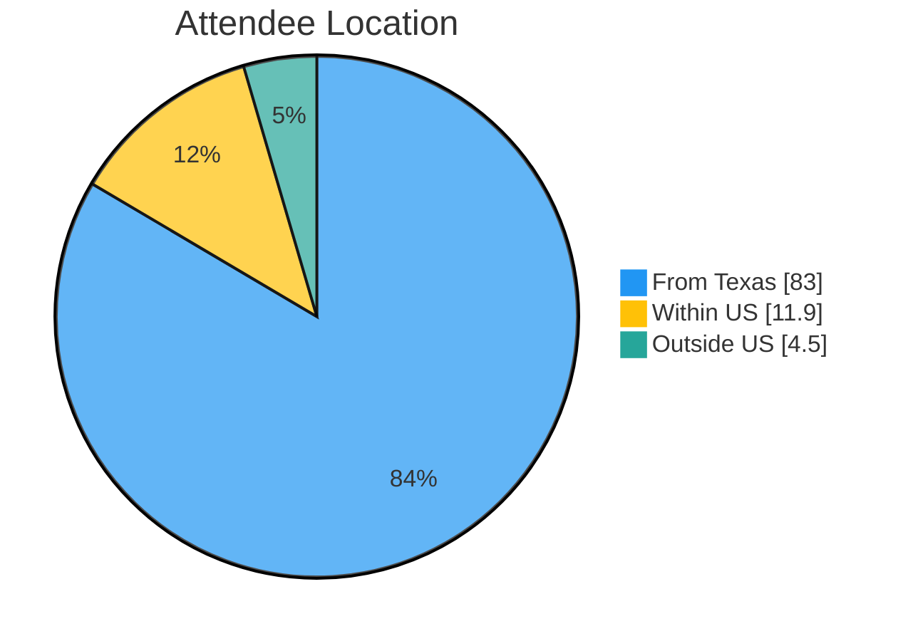
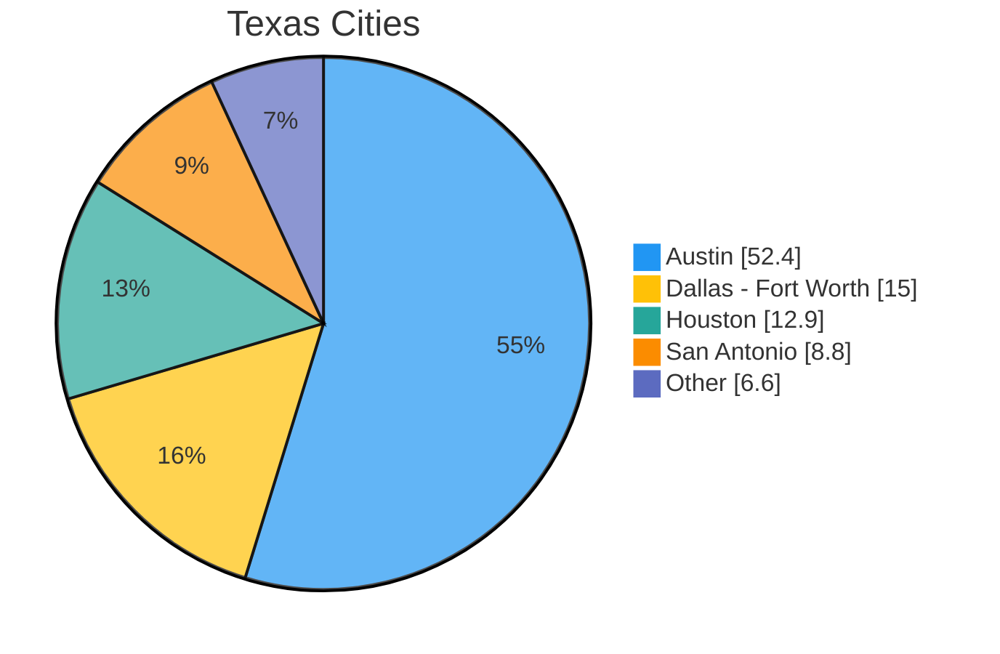
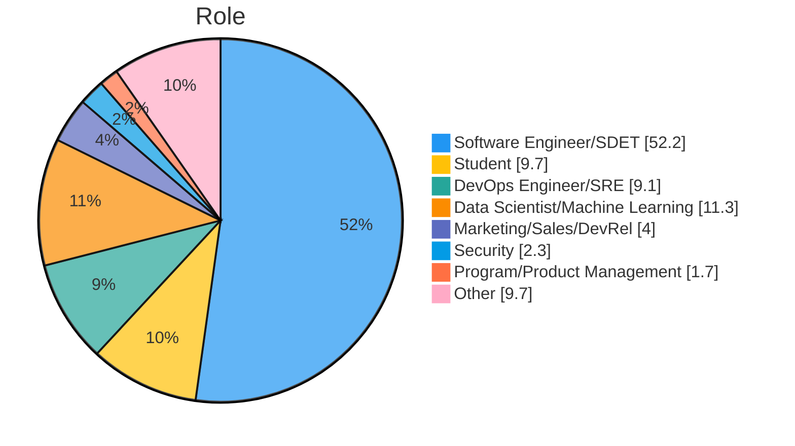
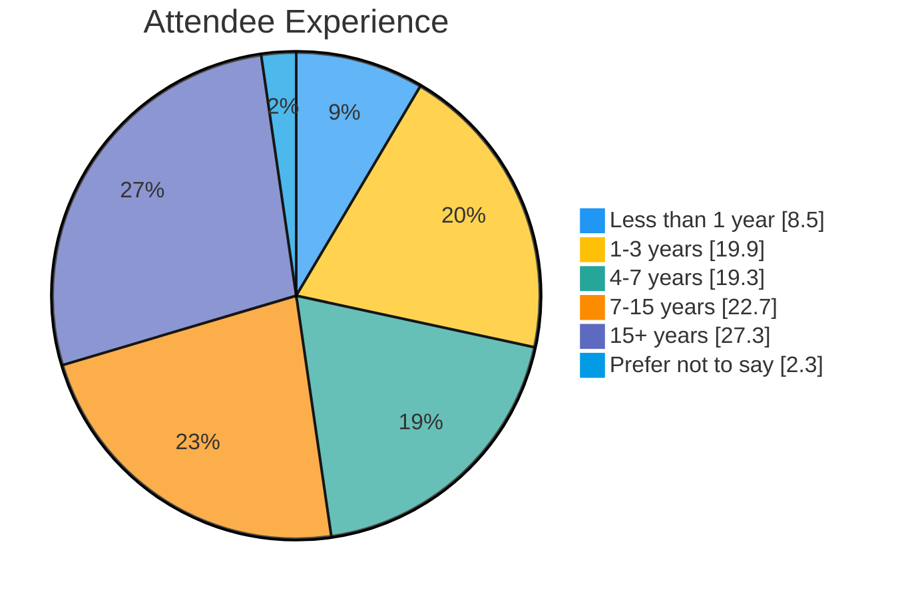
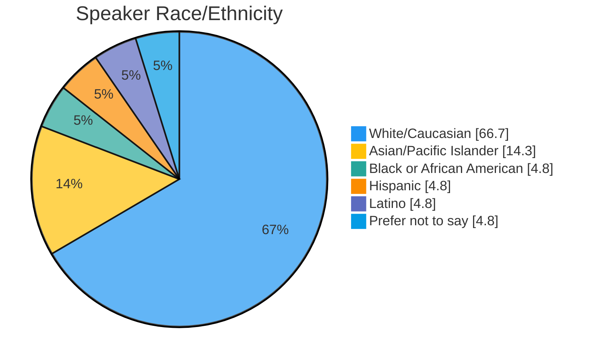
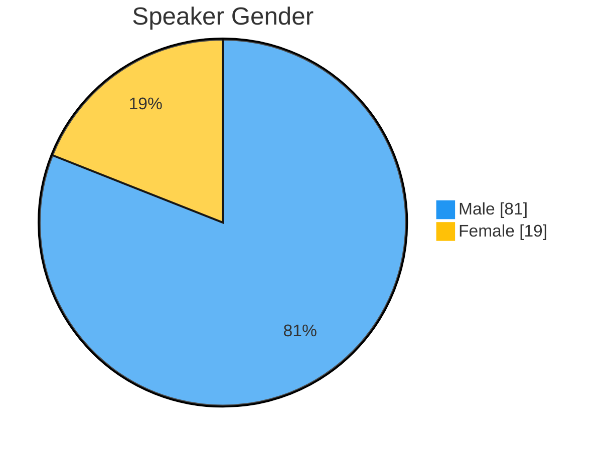
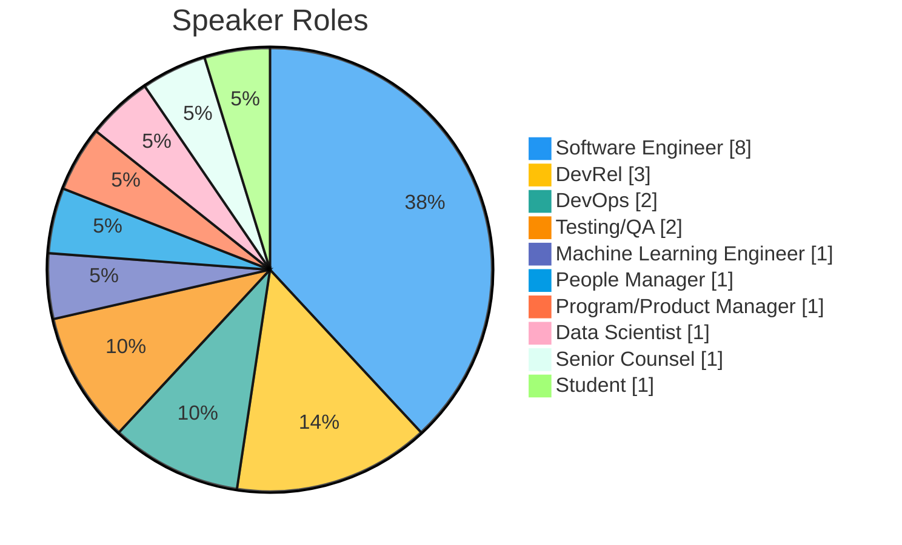
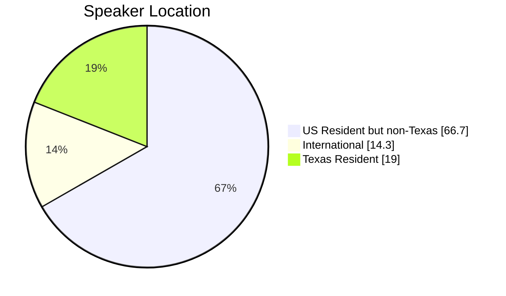

The PyTexas Foundation held the annual PyTexas Conference at the Austin Central Library on April 11  - 13, 2025 in Austin, TX. 
It was a fantastic year with new record-breaking events.
We're excited to share some behind the scenes data with you.

<!-- more -->

## PyTexas 2025 Conference

The 2025 conference was one for the memory books.
From fantastic speakers, generous sponsors, and an always welcoming community, the conference was alive with conversation and friendship.
It was great to see so many people this year returning, wearing their PyTexas shirts from previous years, as well as seeing them bring their friends to come enjoy the conference.
Without any further ado, let's discuss PyTexas 2025.

## What Was New This Year?

PyTexas has a philosophy of incremental change.
We like to consistently improve the conference experience year over year, but we don't flip the table and change everything all at once.
We identify a few things every year, and improve them.
This way we don't take on too much risk by radically altering what has worked for us for the past two decades, we don't risk making the community go "huh" when they walk in the door, and we don't risk burning out the organizers by putting too many new unknown unknowns on their plate.
It's been a win-win-win for everyone.
Here's what we changed this year.

### Live Captions

Live-captioning has always been something we've wanted to do, but the expense prohibited us from doing so, especially in prior years returning from the pandemic where sponsor funding was more of a scarcity.
However, after re-evaluating our sponsorship prospectus this year we decided to add a dedicated sponsorship tier for live-captioning and budgeted to provide it regardless.
We're happy to report that not only were we able to provide live-captioning to our audience this year, but within the final month prior to the conference two sponsors contacted us and decided to sponsor this specific portion of the conference.
With the success that we saw and the outpour of gratitude from our community, we look forward to having live-captioning at the PyTexas Conference for years to come.

### New Swag

This year we offered more than just our PyTexas Conference T-Shirt.
Over the past few years the PyTexas Foundation has been putting down roots and establishing itself as more than just the organization that runs the conference, but the go-to organization for aiding and building Python communities in Texas.
In doing this, we have started doing more branding using our PyTexas logo, which led to us creating pins for attendees to be able to buy.
One of our organizers also had fun with his laser cutter and made some awesome PyTexas wooden chips that we sold as well.

We actually had an even more awesome item planned, but our vendor was unable to produce it in time, so we have shelved it for the 20th year of PyTexas, so if you want to see it, you'll have to come to next year's conference. 

### New Network Event Location

After many years at our faithful location, we decided to expand our Network Event (previously called the After Party, which was neither really a party nor did it happen after the event...) to a new location.
We were able to move our event to [Remedy](https://www.remedyaustin.com/) in downtown Austin, which was only a short walk away from the venue along the Shoal Creek Trail.

## Attendance

2025 was a fantastic, sell-out year for ticket sales!
We sold 296 tickets total.
We sold 253 in-person tickets and 46 virtual tickets. 
We initially set our capacity at 250 in-person attendees, then had to increase it two weeks prior to the conference to 275.

### Statistics

**Location**

* **83%** of attendees were from Texas
    * **52.4%** from Austin
    * **12.9%** from Houston
    * **15%** from Dallas - Fort Worth
    * **8.8%** from San Antonio
    * **6.6%** from other areas in Texas
* **11.9%** are from other states within the United States
* **4.5%** were from outside the United States

**Roles**

* **49.4%** - Software Engineer
* **9.7%** - Students
* **4%** - Marketing/Sales/Business
* **9.1%** - DevOps
* **6.4%** - Data Science/Machine Learning
* **5.2%** - Hobbyist/Enthusiast
* **6.2%** - Executive/Senior Leadership
* The rest consists of ML Engineers, Security, People Managers, Product Management, QA

**Experience**

* **8.5%** - Less than 1 year
* **19.9%** - 1 to 3 years 
* **19.3%** - 4 to 7 years
* **22.7%** - 7 to 15 years
* **27.3%** - 15+ years

### Our Thoughts on Ticket Sales

The same things we posted last year held true this year:

* You have your "regulars" who attend every year. They will take advantage of
early bird sales.
* Announcements drive ticket sales. We saw noticeable increases after we announced
keynotes, tutorials, speakers, etc.
    * The largest increase was after we released the talk schedule.
* You will still sell a majority of your tickets in the month leading up to the event.
* Every time our monthly newsletter went out, ticket sales saw a bump.

## Sponsors

Sponsorship returned in full force this year in a way we've not seen in the past decade of organizing the conference.
We are absolutely blown away by the amount of companies who decided to sponsor us this year, and we owe them a huge thank you.
Sponsorship money means organizers sleep easy at night.
We don't lay awake at night calculating what needs to be cut, what magic amount of tickets we have to sell to break even, or what we will do if we don't break even.

Thank you so much to this year's [sponsors](https://www.pytexas.org/2025/sponsors/our-sponsors/):

* Platinum
    * [Microsoft](https://www.microsoft.com/en-us/)
* Gold
    * [Elastic](https://www.elastic.co/)
    * [Temporal](https://www.temporal.io/)
    * [Python Software Foundation](https://www.python.org/) (grant)
* Food & Coffee
    * [Bloomberg Engineering](https://www.bloomberg.com/company/values/tech-at-bloomberg/)
* Silver
    * [Cloudflare](https://www.cloudflare.com/)
* Live Captioning
    * [Caktus Group](https://www.caktusgroup.com/)
    * [uStudio](https://ustudio.com/)
* Lanyard
    * [Bloomberg Engineering](https://www.bloomberg.com/company/values/tech-at-bloomberg/)
* Bronze
    * [MLOPS World Conference & Expo](https://mlopsworld.com/)
* Community
    * [Black Python Devs](https://blackpythondevs.github.io/)
* Media & Technology
    * [devIT](https://devitjobs.com/jobs/python/all/all)
    * [Big Event](https://bigevent.io/)
    * [pretix](https://pretix.eu/)
    * [TCP - Talent Connect Protocol](https://www.talentconnectprotocol.com/)

### Statistics
This year we brought in a record breaking **$40,750** from sponsorships and grants. 
This is by far the most money we've ever brought in via sponsorship in a single year.
And looking back at our budget, this is more sponsorship budget than we've brought in including the past 4 PyTexas Conferences _combined_.
And the odd thing is, we did less outreach this year than we ever have.
So what do we think moved the needle?

Our hypothesis is, that after two years of running a demographic survey at registration, we now have enough data to show _who_ attends PyTexas.
PyTexas does not give out **any** PII, but we included things like roles, years of experience, and size of company in our prospectus this year.
To our surprise, as you can see in the graphs prior, the PyTexas Conference is a surprisingly senior level conference. 
It's a great opportunity to get your product in front of engineers who may have influence on its usage in their company.

Another hypothesis is that we made the prospectus _as easy to find as possible_.
For so many years we had a link to a PDF of our prospectus with a **big button** that says **Download our prospectus** and every year I would get emails asking for people to send me the prospectus.
This year I received 0 of those emails.
Is it really that simple?
Make your prospectus an HTML page and don't make someone download it, then attach it to an email internally, or worse they send the link and the next person in the chain has to download it too.
I would love if another conference could experiment with this and let us know the results.

## Finances

PyTexas 2025 cost **$48,633.17** to operate. 
This year, we _vigorously_ tracked all expenses, so I'm more confident in this number than I have been in any prior year's numbers.
The largest budget items for us were venue, catering, expansion of A/V, and our expanded network event. 
We sold 319 tickets of varying cost, including add-ons such as shirts & swag, tutorials, and the after party, and made **$31,884.00** in gross revenue (prior to fees). 
This means that our sponsors enabled us to put on the conference and expand to make it better for our attendees and maintain the financial stability of the PyTexas Foundation.

As always, all excess funds from this year will be used to fund ongoing PyTexas Foundation programs such
as the meetup, infrastructure costs, grants, and any future PyTexas event (such as the [PyTexas 2026 Conference](https://pytexas.org/2026)).

## Speakers

Every year our speaker line up continues to get better and better. 
We always get compliments on how good the talks were and takeaways people learned from them.
This year it was an absolute pleasure to welcome  [Mariatta](https://mariatta.ca/) 
and [Jay Miller](https://kjaymiller.com/) to keynote this year. 
Both gave _superb_ keynotes that had everyone talking over lunch. 

From teaching Python, to AI/ML, to DevOps, to writing better docs, this year
we had something for everyone.

### CFP Statistics

CFP submissions this year broke yet another record of ours, the most submissions
to our CFP. Here's some stats:

* 100 submissions from 74 speakers from a wide variety of backgrounds. 
    * 13 indicated they were first time speakers
    * 54 indicated they had never spoken at PyTexas before

The vast majority of our CFP submissions came in within the last few weeks of the
CFP.
Our original deadline was December 1, but we extended it to December 4th.
As you can see on the graph, everyone waited until December 1st to submit, and then once we extended it we saw the last minute bump again.

### Speaker Statistics

We had a _great_ selection of speakers this year. 
We did have a few speakers drop out last minute, which required us to fill in from our reserve list at the last minute.
Here's a more in-depth breakdown of this years speakers:

#### Speaker Race/Ethnicity

* **66.7%** - White/Caucasian
* **14.3%** - Asian/Pacific Islander
* **4.8%** - Black or African American
* **4.8%** - Hispanic
* **4.8%** - Latino
* **4.8%** - Prefer not to say

#### Speaker Gender

* **81%** - Male
* **19%** - Female

This is not a number we're proud of, and many extenuating circumstances outside of our control led to this. 
But results, not excuses.
This will be front and center in our discussions for next year.

#### Speaker Professional Role

* **8** - Software Engineer
* **3** - Developer Relations
* **2** - DevOps
* **2** - Testing/QA
* **1** - Machine Learning Engineer
* **1** - People Manager
* **1** - Program/Product Management
* **1** - Data Scientist
* **1** - Senior Counsel
* **1** - Student

#### Speaker Location

* **66.7%** - Outside of Texas but within the United States
* **19%** - Texas Resident
* **14.3%** - International

Our Texas Resident submissions and acceptances increased greatly this year! 

## Opportunity Grants

Every year we offer opportunity grants to community members who request assistance to attend PyTexas. 
It is my goal to increase this number every year for as long as I can.
For the third year in a row, we were able to increase our opportunity grant funding to $3000.
We were able to provide funding for 7 individuals to attend the PyTexas Conference, and as has been typical for as long as we can remember, we have a 100% attendance rate of those we provide grants to.
We **_strongly_** believe that money should **_never_** be a reason someone can't come to the conference.

And while couldn't provide financial assistance to every applicant, we provided free virtual tickets to every person who applied for assistance so they could watch and interact with the conference, regardless of their location.

## Our Observations as Organizers

This year we saw a few trends that we'd like to share with you that are absolutely fantastic.

First, we saw more people wearing a previous PyTexas Conference or Friends of PyTexas shirt than ever before.
To us, this speaks volumes to the strength of the community we are building.
For reference, this year we had a 60% new attendee rate.
In 2024 that number was 70%.
That's quite the shift in only the course of a year.
Not only do you like us enough to come back, you want other people to know you've been here before and that means the world to us.

Second, we are seeing our community expand beyond Texas.
We have "regulars" now who don't live in Texas.
They come back because of the community we have and that also makes us over the moon excited.
Y'all means all.

Third, it seems a lot more Pythonistas are being health conscious this year, as our fruit and healthy snacks (sugar free sodas and seltzer) disappeared at an exponentially quicker rate than our non-healthy snacks.
As someone who is also personally taking the steps to take better care of their health, I'm right there with you. 
You may have heard the organizers talk about bananas at some point.
I don't know what it is about that particular fruit, but people seem to love it. 
We estimate we went through > 50lbs of bananas over the course of the conference.
Doing the math, that means everyone at the conference ate, on average, at least one banana.
The poor cashier at HEB gave us the weirdest look...
But keep it up!
We hear you, and we'll adjust next years refreshments.

Fourth, people networked **so much** this year.
We saw so many people switching tables, going on walks around the lake, and just mingling.
We saw a group of students who attended for the first time last year go up and talk to our previous keynote speaker and catch up with her.
We saw coworkers who work remotely fly in to the conference to use this as an opportunity to meet.
And we saw friends who hadn't seen each other since the last PyTexas Conference catch up on life after a year.

Finally, y'all made it a point to tell us how awesome the conference was.
Don't get me wrong, people do this every year and let me tell you, it's what keeps us going some nights.
But this year the outpouring of love for the conference was monumental.
And from the bottom of our hearts, we thank you for it.

## Conclusion

The 2025 PyTexas conference will definitely go down as one of the most memorable conferences we've had yet.

All recordings of the talks can be found on the [PyTexas 2025 website](https://www.pytexas.org/2025/schedule/) or on our [YouTube Channel](https://www.youtube.com/watch?v=VzCYbXEz0a4&list=PL0MRiRrXAvRiSmPn_LDdhDbtZwu6g4xct).

Be sure you join us for the 20th year of PyTexas next year!
The [PyTexas 2026](https://pytexas.org/2026) dates have already been set, we'll
be returning to the [Austin Central Public Library](https://library.austintexas.gov/central-library) April 17 - 19, 2026.

We hope to see y'all there!

